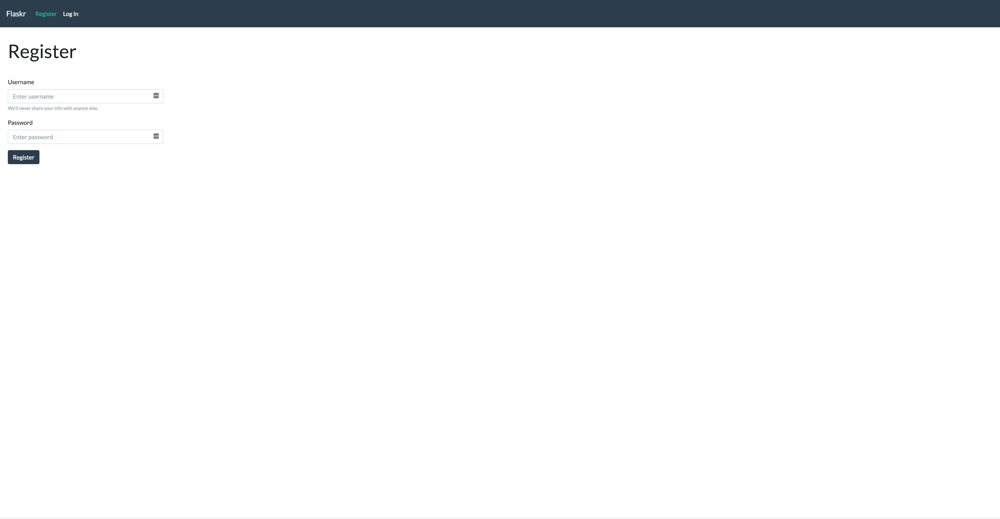
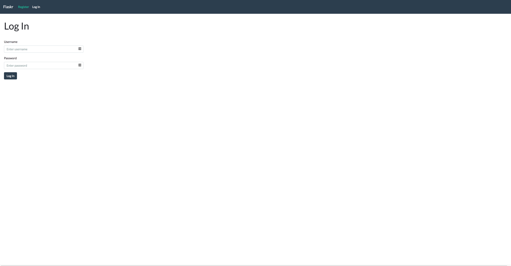
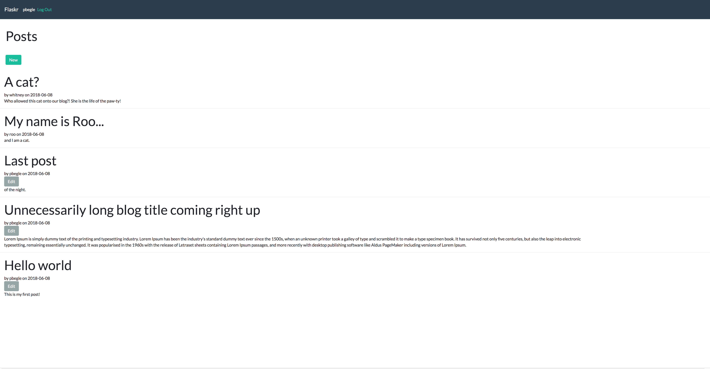
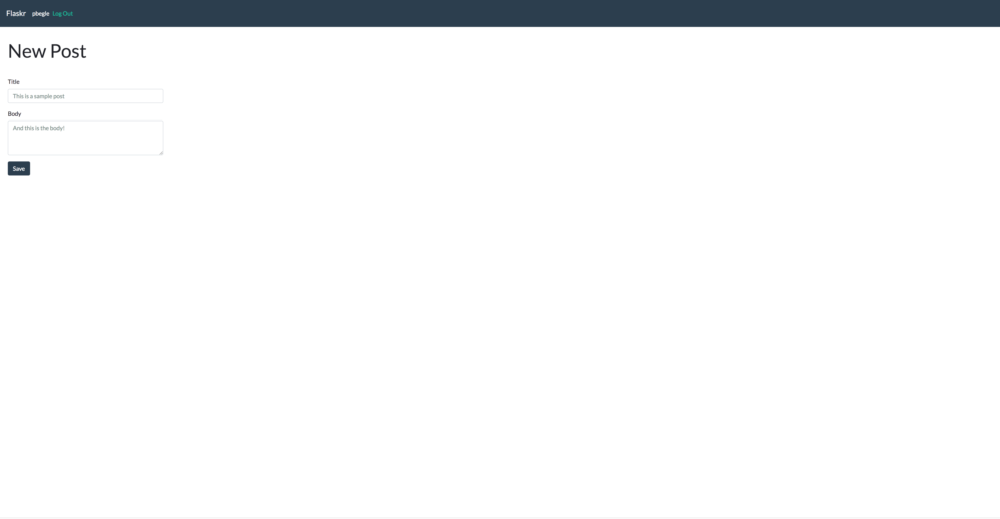
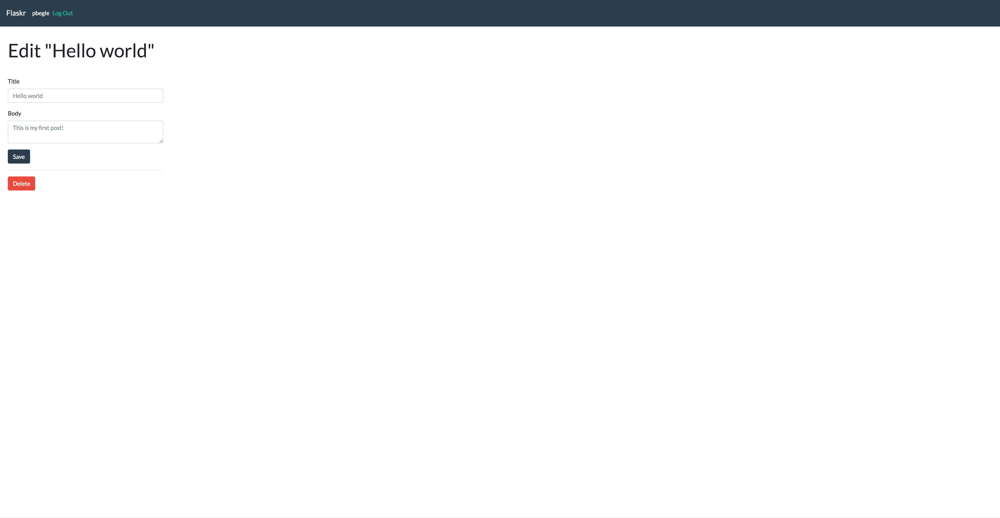

# Flaskr app from the flask [tutorial](http://flask.pocoo.org/docs/1.0/tutorial/).

This is my rendition of the Flaskr blog app from the flask tutorial. The styling for the site is the main difference as I used bootstrap to make it look a little more modern.

Here are sample screenshots of the site:

